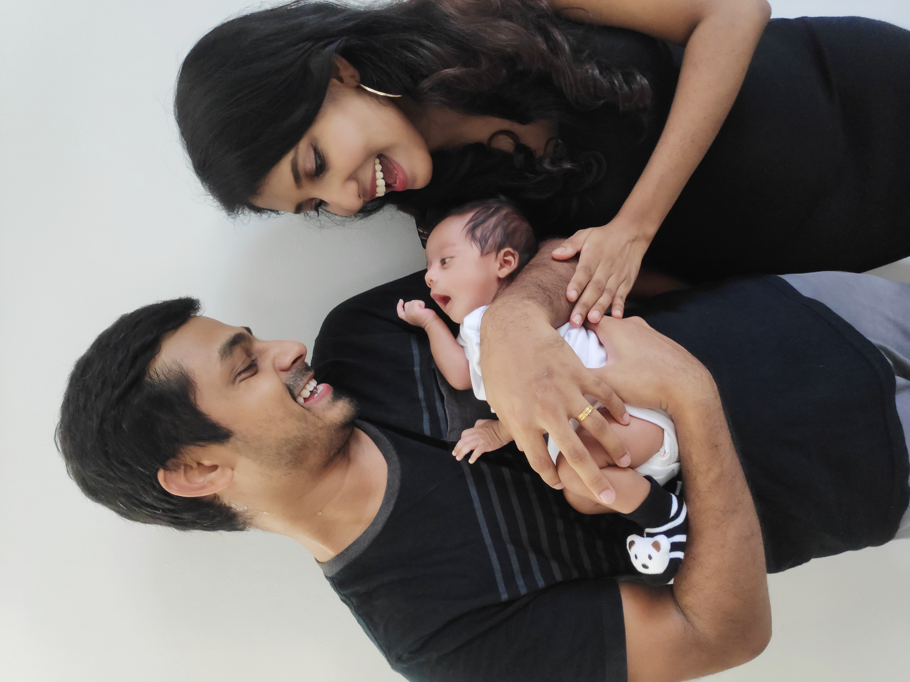

As a pre-requisite, I have acquired the machinery required for the preparation & development of the disaster recovery (DR) site



After signing the contract and obtaining the license to proceed, I spent 2 years ensuring a safe and reliable environment for the development of the DR site. During the kick-off period, I've loaded the machine with the necessary software along with it's dependencies. Since I'm a software guy, not much of the heavy lifting was required on my end but the machine proved to be capable and resilient to produce the required outcome in a mere 8 months which is 1 month earlier than the go-live date. Here's the development photos,

Finally the DR site was delivered and handed over to my hands for continuous imaging

